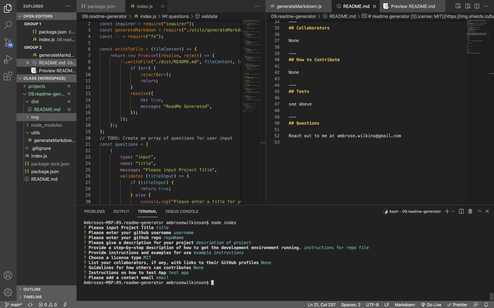

# readme generator 
  
## Description

A simple readme.md generator to help users quickly generate readme for their github repos

GitHub Repo: https://github.com/a-breezy/README-Generator

## Table of Contents

  * [Installation](#installation-instructions)
  * [Usage](#usage)
  * [License](#license)
  * [Collaborators](#collaborators)
  * [How to Contribute](#how-to-contribute)
  * [Tests](#tests)
  * [Questions](#questions)

## Installation Instructions

Open integrated terminal where the readme generator is located. Type 'node index' to start app. When prompted, enter the corresponding information. After completing every prompt your README.md will be generated in the ./dist/ directory.

---
## Usage

*How to Start the Application*

*Completing all Information Fields*

[Link To Video Example](https://drive.google.com/file/d/1epyjdke963435rjnQyuy51sHhGh96kmu/view?usp=sharing)

---
## License

  [License: MIT](https://opensource.org/licenses/MIT)
  

---
## Collaborators

None

---
## How to Contribute

None

---
## Tests

see above

---
## Questions

Reach out to me at ambrose.wilkins@gmail.com
